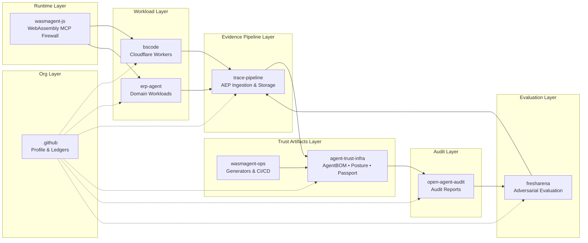
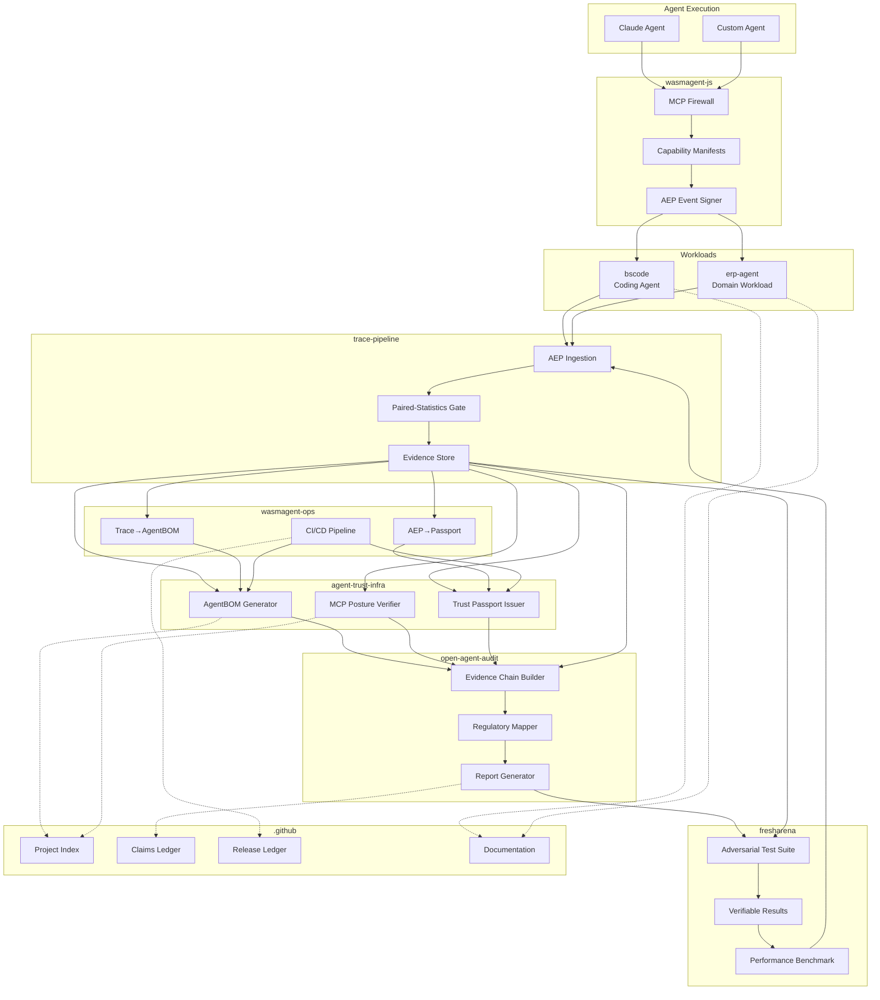
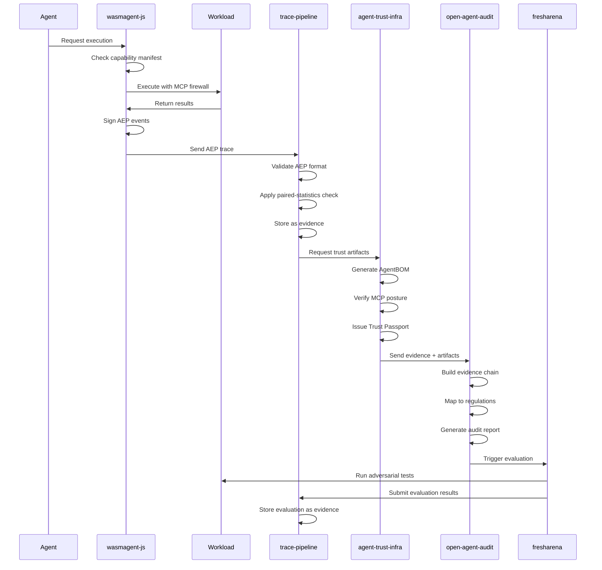
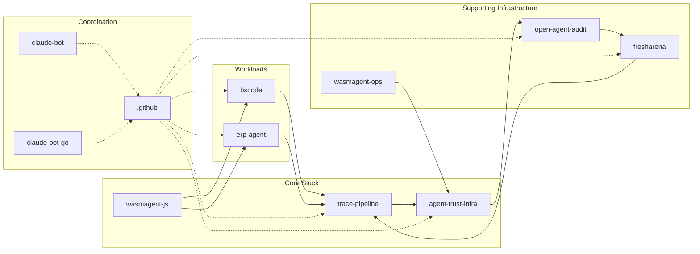

# Architecture

WasmAgent is an evidence-first stack for agent runs: protect execution,
record evidence, layer on trust artifacts, audit claims, and evaluate
adversarially. Each layer maps to a public repository.

## Overview

## Layers

### Runtime — `wasmagent-js`

Sandboxes agent tools in WebAssembly behind an MCP firewall gated by
per-agent capability manifests. Emits signed Agent Evidence Protocol (AEP)
events for every tool call and capability escalation.

**Components:**
- MCP Firewall — restricts tool access based on capability manifests
- Capability Manifests — declare allowed tools and escalation paths
- AEP Event Signer — cryptographically signs all execution events

### Workloads — `bscode`

Reference coding-agent workload on Cloudflare Workers. Demonstrates the
runtime on a real product surface and exports AEP evidence.

**Components:**
- Code Editor interface backed by agent assistance
- AEP trace export for all agent interactions
- Cloudflare Workers deployment scaffold

### Evidence pipelines — `trace-pipeline`

Ingests AEP traces, applies paired-statistics checks as an evidence
admission gate for training data, and records every training run as
auditable evidence.

**Components:**
- AEP Ingestion — accepts and validates AEP event streams
- Paired-Statistics Gate — evidence quality filter for training data
- Evidence Store — auditable storage for all traces

### Trust artifacts — `agent-trust-infra`

Layers machine-readable identity and policy posture onto each run:

- **AgentBOM** — bill of materials for an agent (model, tools, dependencies).
- **MCP Posture** — declared and observed MCP surface and capabilities.
- **Trust Passport** — portable, verifiable run identity and posture.

These artifacts feed downstream audit and evaluation.

**Components:**
- AgentBOM Generator — extracts model, tools, and dependencies
- MCP Posture Verifier — validates declared vs. observed capabilities
- Trust Passport Issuer — creates portable run identity documents

### Ops Tooling — `wasmagent-ops`

Generators and CI/CD infrastructure for automated trust artifact creation.

**Components:**
- Trace→AgentBOM Generator — converts execution traces to AgentBOM
- AEP→Passport Generator — creates Trust Passports from AEP events
- CI/CD Pipeline — auto-generates artifacts on release

### Audit — `open-agent-audit`

Turns the full evidence chain plus trust artifacts into enterprise-readable
audit reports with regulatory mappings. Deployed at
[trustavo.com](https://trustavo.com).

**Components:**
- Evidence Chain Builder — assembles full execution history
- Regulatory Mapper — maps evidence to compliance frameworks
- Report Generator — produces human-readable audit reports

### Evaluation — `fresharena`

Closes the loop with dynamic, verifiable, adversarial evaluation of coding
agents. Results are themselves evidence and re-enter the pipeline, keeping
the runtime, evidence, and audit story grounded in real benchmark
performance.

**Components:**
- Adversarial Test Suite — challenging benchmarks for agent capability
- Verifiable Results — cryptographically verified evaluation outcomes
- Performance Benchmark — standardized metrics across agents

### Project home — `.github`

Org profile, public ledgers (claims, releases, media), and shared docs
(roadmap, architecture, evaluation summary).

**Components:**
- Project Index — machine-readable repo, role, and status registry
- Claims Ledger — public record of org claims
- Release Ledger — public release tracking
- Documentation — architecture, roadmap, evaluation summaries

## Component Diagram

## Data Flow

### Core Flow

1. `wasmagent-js` protects a run and emits AEP events.
2. Workloads such as `bscode` produce verifiable runtime traces.
3. `trace-pipeline` admits and stores those traces as evidence.
4. `agent-trust-infra` attaches AgentBOM, MCP Posture, and Trust Passport.
5. `open-agent-audit` renders the chain into audit reports.
6. `fresharena` evaluates agents adversarially; results re-enter step 3.

### Feedback Loop

Evaluation results from `fresharena` are themselves evidence and flow
back into `trace-pipeline`, creating a continuous improvement loop that
keeps the runtime, evidence, and audit story grounded in real benchmark
performance.

## Repository Relationships

The `.github` repository serves as the coordination hub, maintaining
canonical documentation, public ledgers, and the project index that
all other repositories reference for consistency.
