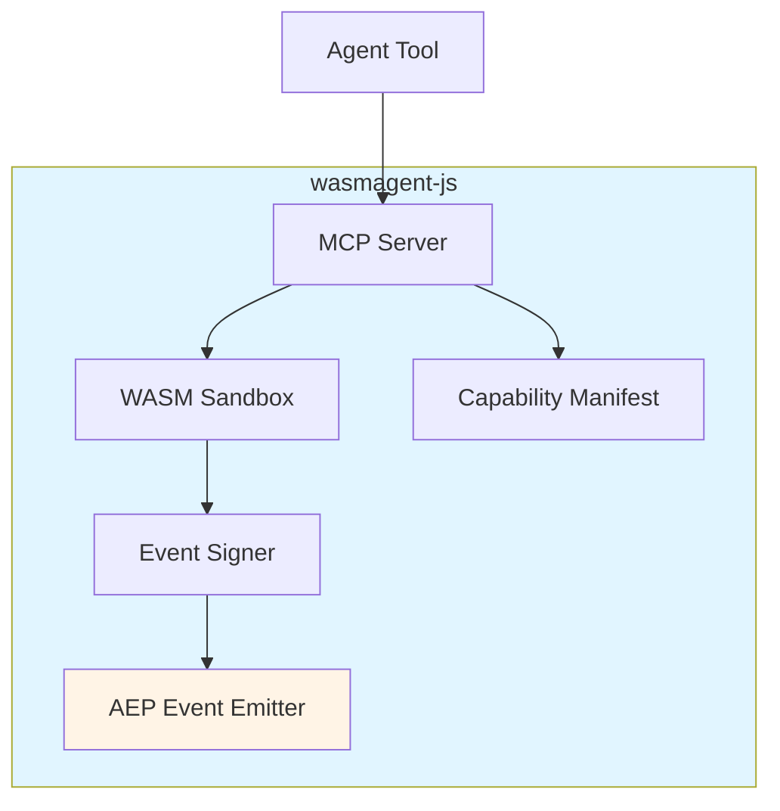
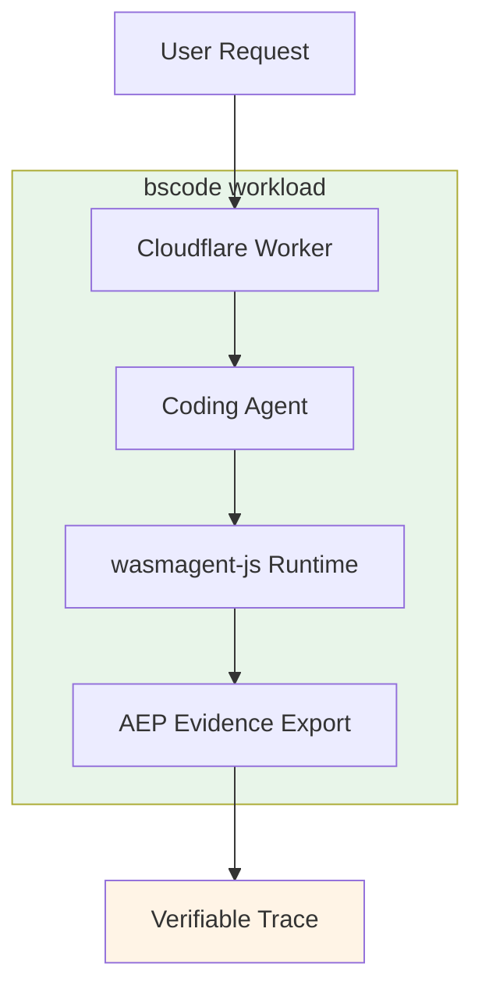
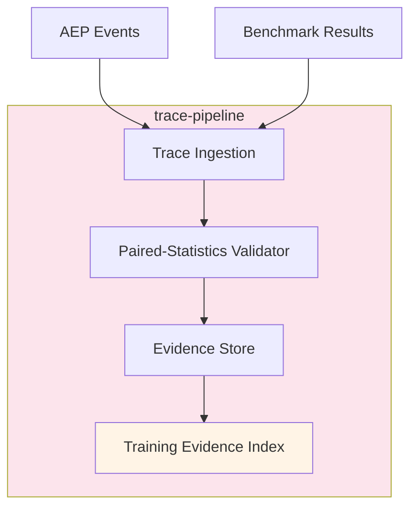
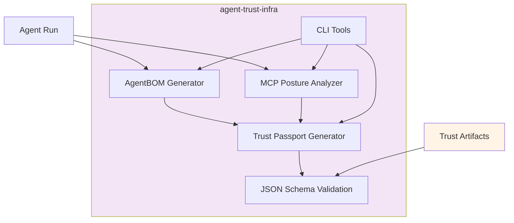
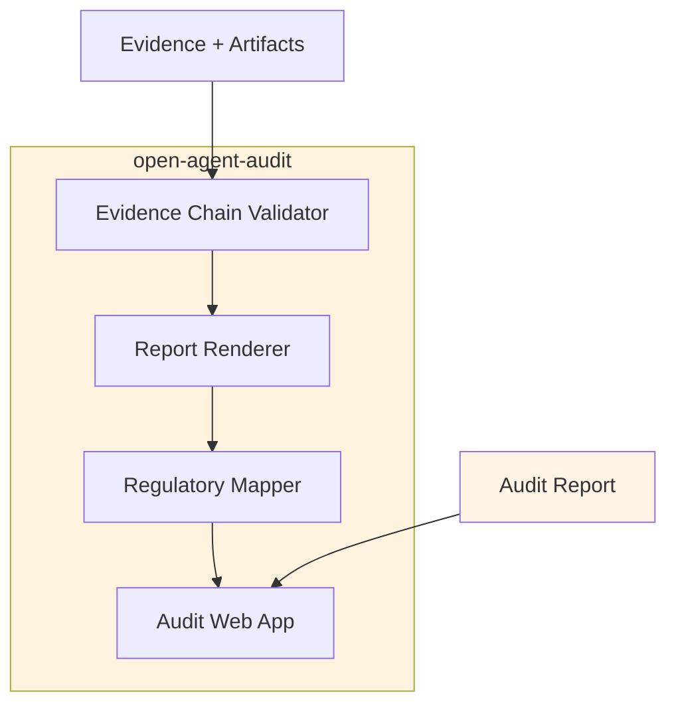
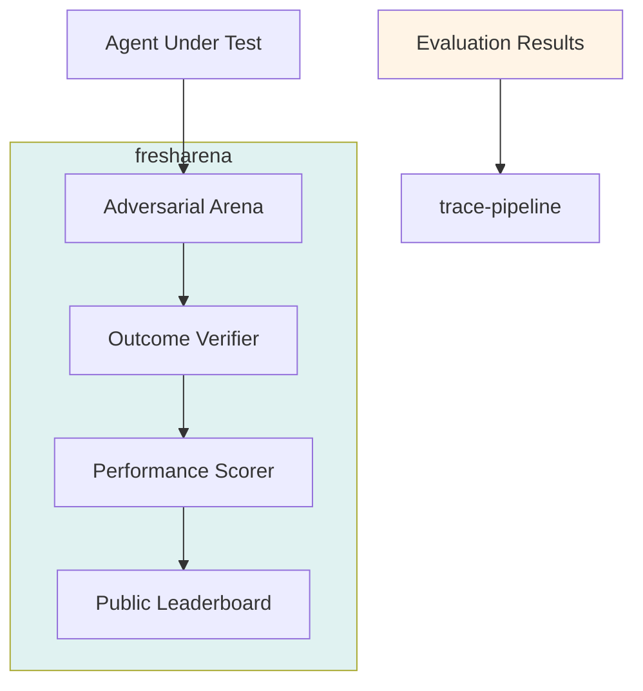
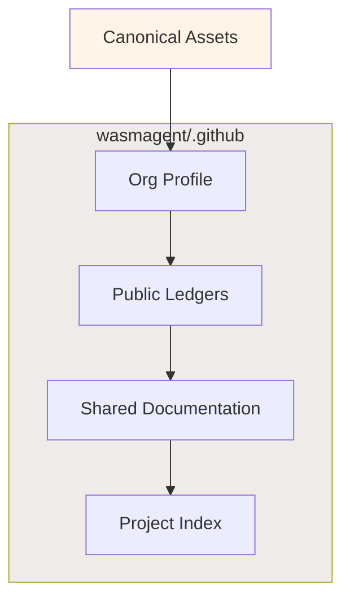

# Architecture

WasmAgent is an evidence-first stack for agent runs: protect execution,
record evidence, layer on trust artifacts, audit claims, and evaluate
adversarially. Each layer maps to a public repository.

```text
Runtime ──▶ Workloads ──▶ Evidence pipelines
                             │
                             ▼
                       Trust artifacts
                             │
                             ▼
                          Audit ◀── Evaluation
```

## Layers

### Runtime — `wasmagent-js`

Sandboxes agent tools in WebAssembly behind an MCP firewall gated by
per-agent capability manifests. Emits signed Agent Evidence Protocol (AEP)
events for every tool call and capability escalation.

### Workloads — `bscode`

Reference coding-agent workload on Cloudflare Workers. Demonstrates the
runtime on a real product surface and exports AEP evidence.

### Evidence pipelines — `trace-pipeline`

Ingests AEP traces, applies paired-statistics checks as an evidence
admission gate for training data, and records every training run as
auditable evidence.

### Trust artifacts — `agent-trust-infra`

Layers machine-readable identity and policy posture onto each run:

- **AgentBOM** — bill of materials for an agent (model, tools, dependencies).
- **MCP Posture** — declared and observed MCP surface and capabilities.
- **Trust Passport** — portable, verifiable run identity and posture.

These artifacts feed downstream audit and evaluation.

### Audit — `open-agent-audit`

Turns the full evidence chain plus trust artifacts into enterprise-readable
audit reports with regulatory mappings. Deployed at
[trustavo.com](https://trustavo.com).

### Evaluation — `fresharena`

Closes the loop with dynamic, verifiable, adversarial evaluation of coding
agents. Results are themselves evidence and re-enter the pipeline, keeping
the runtime, evidence, and audit story grounded in real benchmark
performance.

### Project home — `.github`

Org profile, public ledgers (claims, releases, media), and shared docs
(roadmap, architecture, evaluation summary).

## Component diagrams

### Runtime layer — `wasmagent-js`



**Components**:
- **MCP Server** — Interface between agent tools and sandboxed execution
- **WASM Sandbox** — WebAssembly runtime isolating tool execution
- **Capability Manifest** — Declarative permissions and capability bounds
- **Event Signer** — Cryptographic signature for all AEP events
- **AEP Event Emitter** — Streams signed events to evidence pipeline

### Workload layer — `bscode`



**Components**:
- **Cloudflare Worker** — Serverless execution environment
- **Coding Agent** — Agent implementation performing coding tasks
- **wasmagent-js Runtime** — Embedded sandbox protecting tool calls
- **AEP Evidence Export** — Exports verifiable execution trace

### Evidence pipeline layer — `trace-pipeline`



**Components**:
- **Trace Ingestion** — Accepts AEP event streams from workloads
- **Paired-Statistics Validator** — Evidence admission gate using statistical checks
- **Evidence Store** — Immutable storage for admitted traces
- **Training Evidence Index** — Queryable index of auditable training data

### Trust artifacts layer — `agent-trust-infra`



**Components**:
- **AgentBOM Generator** — Bill of materials for agent configuration
- **MCP Posture Analyzer** — Declared vs observed capability analysis
- **Trust Passport Generator** — Portable identity and posture bundle
- **JSON Schema Validation** — Validates artifact structure
- **CLI Tools** — Command-line interface for all artifact operations

### Audit layer — `open-agent-audit`



**Components**:
- **Evidence Chain Validator** — Validates cryptographic chain of evidence
- **Report Renderer** — Generates human-readable audit reports
- ** Regulatory Mapper** — Maps evidence to regulatory frameworks
- **Audit Web App** — Hosted at trustavo.com

### Evaluation layer — `fresharena`



**Components**:
- **Adversarial Arena** — Dynamic challenge environment
- **Outcome Verifier** — Validates agent outputs against ground truth
- **Performance Scorer** — Computes metrics across test suites
- **Public Leaderboard** — Transparent results display

### Org infrastructure layer — `.github`



**Components**:
- **Org Profile** — Landing page at github.com/WasmAgent
- **Public Ledgers** — Claims, releases, media registries
- **Shared Documentation** — Roadmap, architecture, evaluation summary
- **RFC Registry** — Org-level design decisions and accepted proposals (`docs/RFC/`)
- **Project Index** — Machine-readable repo, role, status registry

## Data flow

1. `wasmagent-js` protects a run and emits AEP events.
2. Workloads such as `bscode` produce verifiable runtime traces.
3. `trace-pipeline` admits and stores those traces as evidence.
4. `agent-trust-infra` attaches AgentBOM, MCP Posture, and Trust Passport.
5. `open-agent-audit` renders the chain into audit reports.
6. `fresharena` evaluates agents adversarially; results re-enter step 3.
