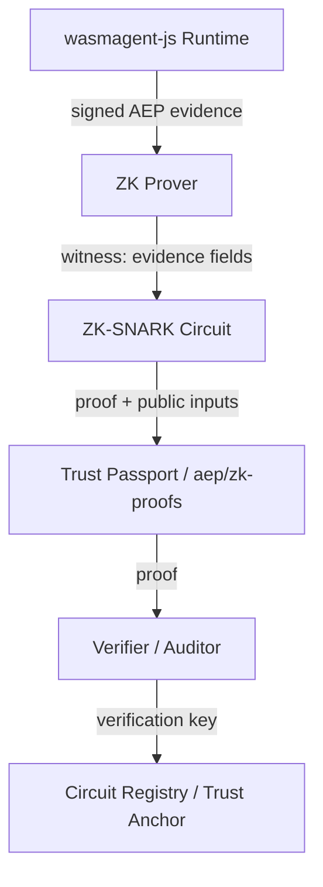
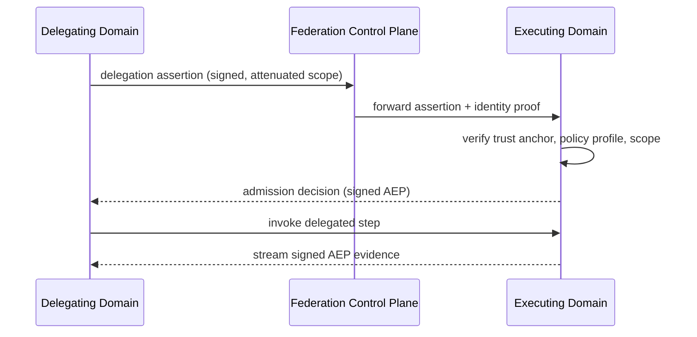
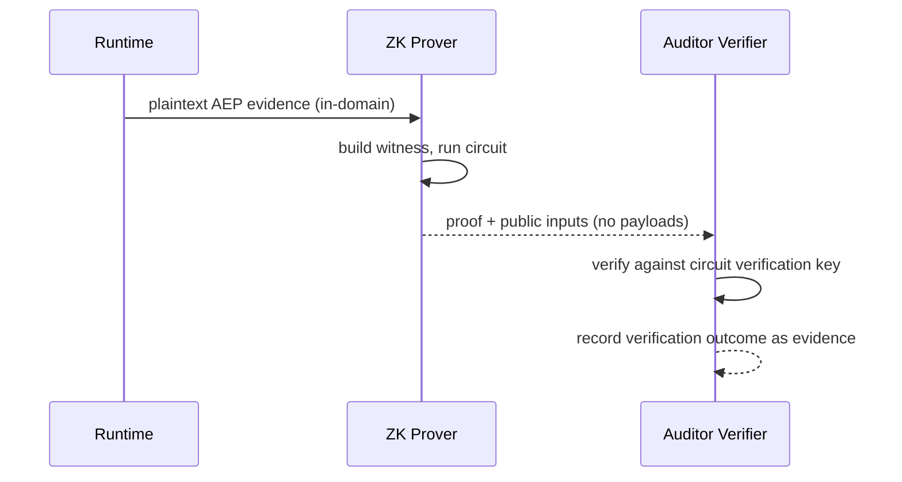

# Cross-Domain Agent Federation Protocol & ZK Attestation Architecture Specification

Status: **Active** — Milestone 6 (Distributed Agent Mesh & Continuous Attestation)

This document is the canonical org-level specification for federating agent
trust across organizational and regulatory boundaries, and for the
Zero-Knowledge (ZK) attestation architecture that makes cross-domain evidence
verification privacy-preserving. It complements
[`docs/architecture.md`](architecture.md) and the layer ownership map in
[`docs/roadmap.md`](roadmap.md).

## 1. Purpose & Scope

WasmAgent agents are executed inside trust domains (a namespace, an
organization, a sovereign cluster). A single agent often needs to delegate
steps to agents hosted in another trust domain — a buyer copilot federating
with a supplier copilot, an ops agent dispatching to a finance agent, or a
coding agent calling an evidence pipeline in another cluster. Cross-domain
federation is the mechanism by which trust artifacts, AEP evidence, and
policy posture travel with the delegation rather than being re-verified
from scratch on every hop.

The two pillars specified here are:

1. **Cross-domain agent federation protocol** — how trust domains discover
   each other, establish mutually authenticated mesh connections, exchange
   identity and delegation assertions, propagate signed AEP evidence, and
   enforce real-time revocation across sovereign boundaries.
2. **ZK attestation architecture** — how AEP evidence can be verified without
   revealing proprietary payload data, via Zero-Knowledge (ZK-SNARK)
   proofs and selective disclosure, enabling compliance auditing of agent
   behavior that would otherwise remain confidential.

Scope boundaries: this repository is the spec hub. Reference surfaces land in
owning sibling repositories (`wasmagent-ops/federation/`,
`aep/zk-proofs/`, `agentbom/`, `trace-pipeline/`, `wasmagent/`,
`wasmagent-js/`), and their milestone bullets are tracked in
[`docs/15-milestones.md`](15-milestones.md).

## 2. Terminology

- **Trust domain** — a boundary with its own identity authority, policy
  store, and evidence ledger. Example: `spiffe://acme-corp` or a sovereign
  WasmAgent mesh cluster.
- **Federation peer** — another trust domain with which this domain has a
  mutually authenticated, policy-bounded relationship.
- **Agent identity** — the machine identity of an agent workload, expressed
  as a DID (`did:wasm:agent123`) and/or a SPIFFE ID
  (`spiffe://acme-corp/ns/payroll/sa/billing`) bound to mTLS credentials.
- **Delegation** — the transfer of a scoped permission set from a delegating
  agent to a delegated agent, carrying the origin chain so every downstream
  action remains attributable to the root requester.
- **AEP evidence** — signed Agent Evidence Protocol events emitted by the
  runtime for every tool call and capability escalation.
- **Trust Passport** — the portable, verifiable bundle of AgentBOM, MCP
  posture, and signed AEP evidence for a run.
- **ZK-SNARK** — a Zero-Knowledge Succinct Non-interactive Argument of
  Knowledge: a short proof that a statement is true without revealing the
  witness.
- **Selective disclosure** — the ability to reveal only the fields of an
  evidence record needed for a given audit decision, hiding everything else.
- **Verifier** — the party that checks a ZK proof against a verification key
  and a public statement without learning the private inputs.

## 3. Cross-Domain Agent Federation Protocol

### 3.1 Trust Domains & Identity

Every agent in the mesh carries a cryptographic identity that is verifiable
outside its home domain:

- **DID identity** — `did:wasm:<agent-id>` resolves to a DID document that
  publishes the agent's verification keys, its issuer domain, and its
  capability set. DIDs make Trust Passports portable across organizations.
- **SPIFFE/SPIRE identity** — `wasmagent-js/spiffe/` binds Wasm sandbox
  workloads to X.509-SVID/JWT-SVID credentials. The SPIFFE trust domain
  doubles as the federation trust domain identifier for mTLS.
- **Key rotation** — identities rotate on a schedule; rotated keys are
  attested in AEP evidence so an auditor can trace which key signed which
  event.

A federated agent must prove possession of its private key whenever it
presents its identity to a remote domain.

### 3.2 Peer Discovery & Mesh Control Plane

Federation relationships are declarative, not ad-hoc:

- A **mesh peer list** (`mesh-peers.yaml`) enumerates the peer trust domains,
  their control-plane endpoints, trust anchors, and the policy profiles each
  peer is permitted to exercise.
- The federation control plane (`wasmagent-ops/federation/`,
  `wasmagent-mesh sync --peers mesh-peers.yaml`) synchronizes peer state,
  routes delegation requests, and propagates revocation signals between
  domains.
- Every control-plane message is signed and carries a monotonic sequence
  number, so replay is detectable and partitions are eventually consistent
  (last-writer-wins per sequence).

### 3.3 Federation Handshake & Mutual TLS

Before any evidence or delegation crosses a domain boundary:

1. The peer presents its SPIFFE ID and a proof of identity.
2. The receiving domain verifies the SPIFFE ID against the configured trust
   anchors and the mesh peer list.
3. mTLS credentials are derived from the SVIDs, pinning every downstream
   request to the authenticated workload identity.
4. A capability handshake negotiates which evidence kinds, policy profiles,
   and proof types the peer may send.
5. The handshake is recorded as a signed AEP event in both domains' ledgers.

Fail-closed: an unlisted trust domain, an expired SVID, or a missing trust
anchor terminates the handshake immediately.

### 3.4 Delegation & Scope Attenuation

Multi-agent federation is built on delegations that attenuate permissions at
every hop:

- A delegating agent issues a **delegation assertion** naming the delegated
  agent, the granted permission scope, the expiry, and the parent delegation
  (forming a chain back to the original requester).
- Nested delegation tracking (`agentbom/lineage`) records each hop as a
  cryptographic graph node, so the full origin chain is auditable
  (`agentbom export-graph --trace-id <id> --format svg`).
- A delegated agent may **never** grant a scope larger than the one it
  received; attempts to escalate are rejected and recorded.
- Delegation assertions are themselves AEP evidence and are verified by the
  receiving domain before any tool call is admitted.

### 3.5 Evidence Exchange Across Domains

Signed AEP evidence flows across domains in both directions:

- **Evidence push** — the executing domain forwards admitted evidence events
  to the delegating domain's evidence pipeline (`trace-pipeline/stream/`) in
  real time for drift detection and passport revocation.
- **Evidence pull** — auditors in the delegating domain query the executing
  domain's ledger for the evidence referenced by a delegation assertion.
- **Evidence chaining** — the receiving domain validates the signature chain
  of each event back to a trust anchor it recognizes, so evidence cannot be
  forged by an intermediate relay.

### 3.6 Cross-Domain Policy Enforcement

Policies do not travel verbatim; they travel as **constraints** that are
evaluated locally but verified globally:

- Inline guardrails embed WebAssembly-native OPA/Rego or CEL evaluators
  (`agentbom/policy/`, `symkernel`) so each domain enforces policy at the
  point of execution.
- The delegating domain's policy profile is translated into a minimal
  permission-bounded set of rules that the executing domain admits via the
  handshake.
- Posture drift detected in one domain (via real-time telemetry) is signaled
  to every federated peer, which re-evaluates outstanding delegations.

### 3.7 Revocation & Real-Time Drift Response

Revocation is the hard part of federation; this spec requires:

- **Immediate propagation** — a revocation or posture-drift signal is pushed
  over the mesh control plane to all peers within a bounded latency, not
  polled.
- **Tokenized revocation** — every delegation and Trust Passport carries a
  revocation nonce; a peer that sees a revoked nonce fails closed on the next
  use.
- **Evidence revocation** — revoked evidence is marked in the issuing ledger
  with a signed revocation record; auditors can distinguish "never existed"
  from "existed and was revoked".
- **Offline safety** — edge runtimes (`wasmagent/edge/`) buffer evidence
  while offline and synchronize to the ledger on reconnect, at which point
  revocation checks run before buffered evidence is admitted.

## 4. ZK Attestation Architecture

### 4.1 Motivation

AEP evidence frequently contains proprietary payloads — tool inputs, model
prompts, code diffs, business documents. Enterprises are willing to prove
that their agents behaved safely but are not willing to hand over the
payloads to an external auditor. ZK attestation decouples **verifiability**
from **disclosure**: an auditor learns that a property held (e.g., "no
sensitive capability was invoked outside the approved scope") without seeing
the underlying data.

### 4.2 Architecture Overview

- The **prover** runs inside the trust domain that holds the plaintext
  evidence; the proof is generated without the evidence leaving the domain.
- The **verifier** runs at the auditor or the delegating domain; it checks
  only the proof and the public inputs.
- The **circuit registry** publishes verification keys (and, where required,
  the common reference string) so any party can verify.

### 4.3 ZK-SNARK Circuits for AEP Evidence

The reference circuit family (`aep/zk-proofs/`,
`passport prove --privacy-mode zk`) supports statements such as:

- **Compliance property proofs** — "all tool calls in this run were within
  the AgentBOM capability set", "no PHI-class payload left the sandbox",
  "the model version and manifest hash match the declared AgentBOM".
- **Signature validity proofs** — "this evidence event was signed by a key
  in the AgentBOM's trust anchor chain" without revealing the event payload.
- **Aggregation proofs** — "these N evidence events all satisfy the policy
  set" in a single succinct proof, so a long agent run audits in constant
  time.
- **Attestation proofs** — the prover proves knowledge of a witness that
  satisfies the circuit's constraints, producing a compact proof
  (typically a few hundred bytes) that verifies in milliseconds.

Circuits are versioned; each circuit version is bound to a schema version of
the AEP evidence it proves, matching `wasmagent-protocol` canonical schemas.

### 4.4 Selective Disclosure

Selective disclosure is the core privacy primitive of the architecture:

- **Field-level redaction** — `agentbom redact --input agentbom.json`
  produces privacy-preserved trust artifacts where sensitive fields are
  replaced by commitments.
- **Proof-based disclosure** — instead of revealing a field, the prover
  reveals a proof that the field satisfies a predicate (e.g., "the
  permission scope is a subset of `[\"read\",\"audit\"]`").
- **Minimum disclosure for audit** — a compliance auditor receives only the
  predicates relevant to the regulation being checked (SOC 2, ISO 27001,
  EU AI Act), never the underlying payloads.
- **Non-repudiation** — the hidden payload is committed into the proof, so
  the prover cannot later change the evidence it attested to.

### 4.5 Proof Generation Flow

1. The runtime emits signed AEP evidence (plaintext) to the evidence
   pipeline inside the trust domain.
2. The `aep/zk-proofs` exporter selects the circuit matching the audit
   predicate and builds a witness from the evidence fields.
3. The prover runs the circuit and produces `proof.json` plus the public
   inputs (`zk-verify --proof proof.json --schema aep-v1`).
4. The proof and public inputs are attached to the Trust Passport as
   a ZK-attested evidence bundle.
5. The passport is shared with the auditor; the plaintext evidence never
   leaves the domain.

### 4.6 Verification

Verification is deliberately cheap and stateless:

- The verifier loads the circuit verification key from the circuit registry
  (pinned by circuit ID + schema version).
- It checks the proof against the public inputs; a valid proof asserts that
  some witness satisfying the circuit exists.
- It then evaluates the *public* policy surface (which capabilities, which
  schema version, which timestamps) against the delegating policy profile.
- Verification results are themselves recorded as AEP evidence, giving
  auditors an audit trail of audits.

A verification failure can mean (a) a malformed proof, (b) a mismatched
circuit version, or (c) an actual violation. All three are distinguishable in
the verifier's output, and the outcome is reported as a machine-readable
decision.

### 4.7 Trusted Setup & Key Management

- Circuits require a common reference string / trusted setup; the org uses
  ceremony outputs published alongside each circuit version in the circuit
  registry.
- Proving keys are domain-local secrets; verification keys are public.
- Key ceremonies are reproducible (Powers-of-Tau style) so third parties can
  independently confirm setup integrity.

### 4.8 Compliance Use Cases

- **Cross-organization audit** — a customer's auditor verifies ZK proofs of
  runtime behavior without receiving proprietary agent prompts or tool
  payloads.
- **Regulatory evidence packs** — versioned compliance policy packs (SOC 2,
  ISO 27001, EU AI Act) map each control to a ZK circuit, so an enterprise
  can produce per-control proofs on demand.
- **Federated governance** — a delegating domain audits a delegated domain's
  execution via proofs instead of raw evidence dumps, keeping both sides'
  data under their own control.

## 5. Message Flows

### 5.1 Cross-Domain Delegation

### 5.2 ZK Compliance Audit

## 6. Threat Model

The federation and ZK design addresses the following threats:

| Threat | Mitigation |
|---|---|
| Rogue peer domain | SPIFFE trust anchors, mesh peer allow-list, fail-closed handshake |
| Replayed delegation / evidence | Sequence numbers, revocation nonces, signed ledger appends |
| Permission escalation | Scope attenuation per hop, lineage graph, escalation detection |
| Payload exfiltration during audit | ZK proofs + selective disclosure; plaintext stays in-domain |
| Proof forgery | ZK-SNARK soundness, versioned circuits, public verification keys |
| Revocation lag | Push-based propagation over the control plane, bounded latency |
| Key compromise | Rotation attested in AEP evidence; per-circuit key separation |
| TOCTOU on policy | Policy evaluated at execution time by local evaluators; drift re-checked on reconnect |

## 7. Repository Map & Integration

| Capability | Owning repo / surface | Status |
|---|---|---|
| Federation control plane & mesh sync | `wasmagent-ops/federation/` | Planned |
| ZK-SNARK proof exporter | `aep/zk-proofs/` | Planned |
| DID/VC support in Trust Passports | `agentbom/federation` | Planned |
| Multi-agent delegation lineage | `agentbom/lineage` | Planned |
| Real-time evidence stream & revocation | `trace-pipeline/stream/` | Shipped (reference surface in hub) |
| Edge offline buffering / ledger sync | `wasmagent/edge/` | Shipped (reference surface in hub) |
| SPIFFE/SPIRE identity driver | `wasmagent-js/spiffe/` | Shipped (reference surface in hub) |
| OPA/Rego inline evaluator | `agentbom/policy/` | In progress |
| Mesh integration test suite | `tests/mesh/` | Planned |

Sibling repos own their implementations; this hub owns the protocol spec, the
reference surfaces, and the cross-repo integration tests that keep the
surfaces honest.

## 8. References

- [`docs/architecture.md`](architecture.md) — org architecture and data flow.
- [`docs/roadmap.md`](roadmap.md) — layer status and planned federation work.
- [`docs/15-milestones.md`](15-milestones.md) — Milestone 6 bullet tracking.
- [`docs/project-index.json`](project-index.json) — machine-readable repo registry.
- `docs/RFC/RFC-0002-cfep.md` — Cloudflare Federation Evidence Protocol notes.
