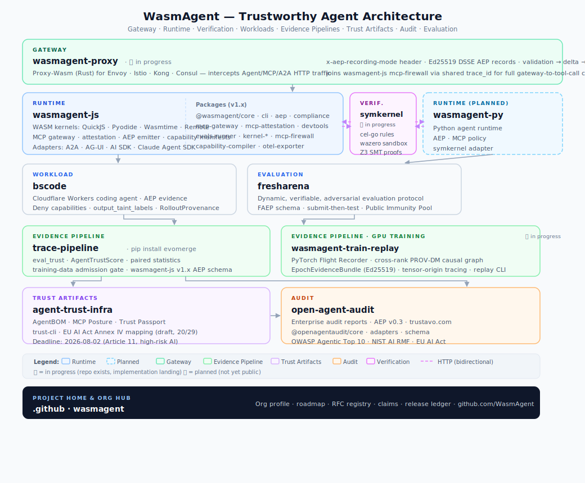

# WasmAgent

Protect agent runs. Record evidence. Audit claims. Train only from trusted traces.

## Projects

| Repository | Role |
| --- | --- |
| [wasmagent-js](https://github.com/WasmAgent/wasmagent-js) | Embedded agent runtime — WASM sandbox, MCP firewall, capability manifests, AEP emitter |
| [bscode](https://github.com/WasmAgent/bscode) | Reference coding-agent workload on Cloudflare Workers; AEP evidence export |
| [trace-pipeline](https://github.com/WasmAgent/trace-pipeline) | Measurement trust · evidence admission gate · training-audit backend |
| [agent-trust-infra](https://github.com/WasmAgent/agent-trust-infra) | Agent Trust Infrastructure — AgentBOM, MCP Posture, and Trust Passport spec, reference impl, and CLI |
| [open-agent-audit](https://github.com/WasmAgent/open-agent-audit) | Enterprise audit product — evidence reports, regulatory mappings, benchmark claim audit |
| [fresharena](https://github.com/WasmAgent/fresharena) | Dynamic, verifiable, adversarial evaluation protocol for coding agents |
| ⚙️ [claude-bot](https://github.com/WasmAgent/claude-bot) | Internal automation — issue triage, PR review, and cross-repo coherence patrol (not a public product) |

Planned: `erp-agent` — an ERP-domain workload with order-state and ledger
verifiers, mirroring the role `bscode` plays for coding tasks.

> ⚙️ marks **internal** repositories that support org operations
> (automation, patrols, tooling) but ship no public product. They are listed
> here to keep the public inventory complete and accurate.

## Product matrix

`wasmagent-js` protects agent execution and emits signed AEP events. Real
workloads (`bscode`, future `erp-agent`) produce verifiable runtime traces.
`trace-pipeline` audits benchmark claims with paired statistics, gates training
data admission, and records every training run as auditable evidence.
`agent-trust-infra` layers on trust artifacts — AgentBOM, MCP Posture, and
Trust Passport — giving every agent run a machine-readable identity and
policy posture that feeds downstream audit.
`open-agent-audit` turns the full evidence chain into enterprise-readable
audit reports — deployed at **[trustavo.com](https://trustavo.com)**.
`fresharena` closes the loop with dynamic, verifiable, adversarial evaluation
of coding agents, ensuring the runtime, evidence, and audit story is grounded
in real benchmark performance.

## What is Trustavo?

**[Trustavo](https://trustavo.com)** is the production deployment of
OpenAgentAudit. The name combines *trust* with *-avo* — evoking a trustworthy,
authoritative voice. In AI governance, evidence only counts when it is trusted;
Trustavo exists to make that trust legible to enterprise teams, auditors, and
regulators.

## Maintainers wanted

We are looking for maintainers across several focus areas. Open to
part-time and async contribution; commit access is granted after a
sustained track record.

- **Runtime** — `wasmagent-js`, AEP, MCP firewall, capability manifests
- **Workloads** — `bscode`, the planned `erp-agent`, future domain workloads
- **Pipelines** — `trace-pipeline` (measurement trust, admission, training audit)
- **Trust artifacts** — `agent-trust-infra` (AgentBOM, MCP Posture, Trust Passport)
- **Audit product** — `open-agent-audit` / Trustavo
  (evidence reports, Cloudflare Workers)
- **Evaluation** — `fresharena` (adversarial evaluation protocol for coding agents)
- **Adapters** — OpenTelemetry GenAI, Langfuse, LangSmith ingestion
- **Regulatory profiles** — OWASP Agentic Top 10, NIST AI RMF,
  ISO/IEC 42001, EU AI Act Annex IV mappings
- **DevRel & docs** — quickstart guides, integration walkthroughs, sample reports

Interested? Open an issue titled `maintainer: <area>` in the relevant
repository, or start a GitHub Discussion in the project home repository.

## Ledgers & registries

Public ledgers and shared docs live in this repository so they belong to the
org, not any single product.

- [Claims registry](../claims/public-claims.yml) — org claims mapped to evidence and review status
- [Release ledger](../releases/public-release-ledger.yml) — public releases across repositories
- [Media & posts](../media/posts.yml) — talks, posts, and appearances
- [Roadmap](../docs/roadmap.md) — living roadmap mirroring the public repo list

## Disclaimer

Repositories in this organization produce **technical evidence** and
research tooling. They do not provide legal advice, regulatory
certification, or compliance determinations.
