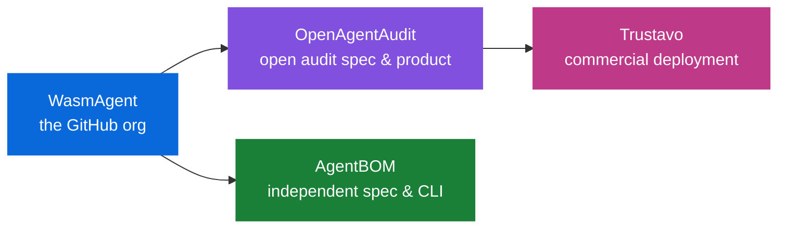

# WasmAgent — Open infrastructure for provable AI agents

> The industry's focus is shifting from *"can the agent do the task?"* to *"can the agent run reliably, at scale, over time?"* We believe that is still not enough. The real question is: **"can you prove the agent ran correctly?"**
>
> WasmAgent is **open infrastructure for _provable_ AI agents** — the layer that turns agent execution into signed, verifiable, auditable evidence: runtime isolation, protocol-level interception, symbolic verification, tamper-evident evidence, and regulatory compliance, composable rather than a single product.
>
> Parts of this vision are shipping today. Parts are in active development. The table below is honest about which is which.

## One map: how the four names fit together


```mermaid
flowchart LR
    W["WasmAgent<br/>the GitHub org"]:::org
    O["OpenAgentAudit<br/>open audit spec & product"]:::audit
    T["Trustavo<br/>commercial deployment"]:::commercial
    B["AgentBOM<br/>independent spec & CLI"]:::bom

    W --> O
    W --> B
    O --> T

    classDef org fill:#0969da,stroke:#0969da,color:#ffffff,stroke-width:2px
    classDef audit fill:#8250df,stroke:#8250df,color:#ffffff,stroke-width:2px
    classDef commercial fill:#bf3989,stroke:#bf3989,color:#ffffff,stroke-width:2px
    classDef bom fill:#1a7f37,stroke:#1a7f37,color:#ffffff,stroke-width:2px
```

One line each — what it is, who it is for, where to find it:

- **[WasmAgent](https://github.com/WasmAgent)** — the GitHub organization behind open infrastructure for provable AI agents; for anyone who needs signed, verifiable agent evidence; [github.com/WasmAgent](https://github.com/WasmAgent).
- **[OpenAgentAudit](https://github.com/WasmAgent/open-agent-audit)** — the open audit specification and product; for enterprise teams, auditors, and regulators; [open-agent-audit](https://github.com/WasmAgent/open-agent-audit).
- **[Trustavo](https://trustavo.com)** — the commercial compliance-report layer built on OpenAgentAudit; for teams that want the open stack deployed and managed for them; [trustavo.com](https://trustavo.com).
- **[AgentBOM](https://github.com/WasmAgent/agentbom)** — the independent agent bill-of-materials spec and CLI; for developers who need machine-readable agent identity and dependency checks; [agentbom](https://github.com/WasmAgent/agentbom).

## Verified Claims

**5 active public claims** · Last reviewed: **2026-07-16**

Our [`public-claims.yml`](https://github.com/WasmAgent/.github/blob/main/claims/public-claims.yml)
contains 5 public claims about our software properties, each with an evidence
link and review date — independently checkable.

## Golden Path

The fastest way to see the provable-agent stack run end-to-end is the
**[`agent-golden-path`](https://github.com/WasmAgent/agent-golden-path)** reference
app (public, MIT) — a runnable procurement copilot that wires every layer together:

```bash
git clone https://github.com/WasmAgent/agent-golden-path
cd agent-golden-path
bun install && bun test        # end-to-end chain test, no live LLM required
```

It proves the full chain in one app: agent execution → tool admission
(`mcp-firewall`) → compliance verification → signed **AEP** evidence → audit
report + trust passport (`open-agent-audit`). This is the canonical reference the
rest of the ecosystem points to.

> There is also an org-level cross-repo integration harness in
> [`golden-path/`](../golden-path/) (`Protect → Record → Audit → Admit`, one step
> per core repo). It is the multi-repo contract acceptance line and is still a
> work in progress — for a runnable demo, use `agent-golden-path` above.

## Projects

WasmAgent is organized around the **evidence lifecycle** — the path from
"the agent did something" to "here's proof it did the right thing." Repos are
grouped by their role in that lifecycle: **define** the format, **produce**
the evidence, **verify** it, and **improve** from it. A first-time visitor
should be able to trace the pipeline from producer to consumer at a glance.

This section is the human-readable view of
[`docs/project-index.json`](../docs/project-index.json), the machine-readable
source of truth. This repository (`.github`) is the organization's sole
public portal.

### 📐 Protocol — the contract

Canonical JSON Schemas that every repo agrees on. Published as
`@wasmagent/protocol` (npm) and `wasmagent-protocol` (PyPI). Per the org
repository-boundary policy, schemas are **never vendored** — consumers always
depend on the published package.

| Repository | Role |
| --- | --- |
| [wasmagent-protocol](https://github.com/WasmAgent/wasmagent-protocol) | **Canonical AEP + compliance JSON Schemas** — aep-record (v0.5 attribution grading with floor, itemization, evidence count), compliance contract family, trust-score schema, RFC registry. Released 0.1.10. |

### ⚡ Evidence producers — where signed evidence is born

| Repository | Role |
| --- | --- |
| [wasmagent-js](https://github.com/WasmAgent/wasmagent-js) | **Runtime monorepo** (v1.x, 40+ packages) — WASM kernels (QuickJS, Pyodide, Wasmtime, Remote), AEP emitter with aep/v0.5 attribution grading and DSSE signing, MCP gateway + attestation + firewall + posture, capability manifests, model adapters (Anthropic, OpenAI, Doubao, Qwen, local), CLI, devtools, evals-runner, Cloudflare Worker, React components. The **primary evidence producer**. |
| [wasmagent-proxy](https://github.com/WasmAgent/wasmagent-proxy) | **Gateway** (Rust, Proxy-Wasm) — network-boundary evidence engine for Envoy, Istio, Kong, Consul. Emits aep/v0.5 records with DSSE signing and attribution grading at the network boundary. |
| [bscode](https://github.com/WasmAgent/bscode) | **Coding workload** on Cloudflare Workers — AEP evidence export, deny capabilities, output taint labels, RolloutProvenance. |

> **`wasmagent-py`** *(planned)* joins this tier as the Python runtime sibling —
> same AEP schema, Criterion/ConstraintIR protocol, and symkernel adapter — so
> evidence is emitted wherever agents actually run, not just in JS.

### 🔍 Verification & trust — checking evidence, establishing trust

| Repository | Role |
| --- | --- |
| [open-agent-audit](https://github.com/WasmAgent/open-agent-audit) | **Audit product** — adapters (AEP → canonical events), scoring (Evidence Admission Score with attribution-integrity bonus), policy audit, reports (Markdown/HTML/PDF/CSV/JSON), dashboard, worker, Trust Passport signing. Deployed at [trustavo.com](https://trustavo.com). |
| [agentbom](https://github.com/WasmAgent/agentbom) | **Trust & BOM tooling** — AgentBOM validator, compliance checker (SOC2/ISO27001/EU AI Act), MCP Posture diff engine, CLI, framework adapters (AutoGen, LangChain, LlamaIndex), WASM-native OPA/Rego policy evaluator. |
| [symkernel](https://github.com/WasmAgent/symkernel) | **Formal proof engine** (Go, Research/Preview) — cel-go rules, wazero Wasm sandbox hard-isolation, Z3 SMT proofs; imports OPA Rego / AWS Cedar policies (translated to CEL, fail-closed). |

### 📊 Training & evaluation — evidence-driven improvement

| Repository | Role |
| --- | --- |
| [trace-pipeline](https://github.com/WasmAgent/trace-pipeline) | **Training-data gate** (`evomerge` on PyPI) — AEP validation, attribution-grading consumption, trust score, paired statistics, adversarial suite, training-data admission gate. |
| [wasmagent-train-replay](https://github.com/WasmAgent/wasmagent-train-replay) | **GPU training evidence** (Research/Preview) — PROV-DM provenance graph, Ed25519-signed EpochEvidenceBundles, deterministic replay CLI. |
| [fresharena](https://github.com/WasmAgent/fresharena) | **Adversarial evaluation** — FAEP schema, submit-then-test, Public Immunity Pool; paper in preparation. |

### 🔗 Reference & hub

| Repository | Role |
| --- | --- |
| [agent-golden-path](https://github.com/WasmAgent/agent-golden-path) | **Golden Path** — a procurement copilot proving the full chain end to end: execution → `mcp-firewall` → compliance → signed **AEP** evidence → audit report + trust passport. `bun install && bun test`, no live LLM. |
| [`.github`](https://github.com/WasmAgent/.github) | **Org hub** — portal, roadmap, claims registry, release ledger, project index, cross-repo docs. |

## Vision

The broader industry is converging on *Agent Runtime / Agent OS* as the next infrastructure frontier — the layer that moves agents from stateless one-shot calls to long-running, stateful, recoverable systems. We agree with that framing, and we go one step further.

**Reliability is necessary but not sufficient.** An agent that runs stably but whose behavior cannot be verified, audited, or proven correct is not ready for production systems, regulated industries, or multi-agent trust chains. The gap between "it finished" and "it did the right thing" is exactly where WasmAgent operates.

Provable AI agents rest on three layers that a plain Agent Runtime omits:

| Layer | What it solves | Status |
| --- | --- | --- |
| **Provable correctness** | `symkernel` — cel-go rules, wazero hard-isolation, Z3 SMT proofs; imports OPA Rego / AWS Cedar policies (fail-closed) so existing policies gain formal proof | 🚧 in progress · Research / Preview |
| **Tamper-evident evidence** | AEP (Agent Evidence Protocol) — Ed25519-signed behavioral records at gateway and runtime | shipping in `wasmagent-js` v1.x |
| **Regulatory compliance** | EU AI Act Annex IV mapping, OWASP Agentic Top 10, NIST AI RMF | draft in `agentbom` |

Put plainly: a plain Agent Runtime runs things reliably at scale; open infrastructure for *provable* AI agents adds the proof, signed evidence, and compliance mapping on top — composable, open, and infrastructure-grade.

## Architecture


The **gateway** layer — `wasmagent-proxy` — sits at the network boundary, intercepting
Agent/MCP/A2A HTTP traffic across Envoy, Istio, Kong, and Consul, and emitting
Ed25519-signed AEP records before requests reach the runtime.

The **runtime** layer — `wasmagent-js` (v1.x) — protects agent execution across
multiple WASM kernels, enforces MCP policy via `mcp-gateway` and `mcp-attestation`,
and emits signed AEP events that flow into verifiable runtime traces. A Python
sibling, `wasmagent-py`, is planned and will share the same AEP schema, protocol,
and symkernel adapter.

`symkernel` (Research / Preview) backs both runtimes with symbolic verification:
cel-go for lightweight high-frequency rule evaluation, wazero for hard-isolated
Wasm sandbox execution of LLM-generated code, and Z3 SMT solving for combinatorial
constraint proofs. It has no stable API or published package yet; interfaces change
as experiments evolve.

`bscode` and `fresharena` are the two live agent surfaces: coding workload and
adversarial evaluation, both instrumented to produce AEP evidence.

`trace-pipeline` (`evomerge` on PyPI) gates training-data admission with paired
statistics and records every training run as auditable evidence. Compatible with
`wasmagent-js` v1.x AEP schema. `wasmagent-train-replay` (Research / Preview)
extends this to distributed GPU training jobs: it reads PyTorch Flight Recorder
dumps, builds a cross-rank PROV-DM causal graph, and produces tamper-evident
`EpochEvidenceBundle` records, enabling tensor-origin tracing and deterministic
replay. It is research-stage — no stable API or published package yet.

`agentbom` (`@wasmagent/agentbom-core`, `@wasmagent/agentbom-cli`) produces trust
artifacts — Agent Bill of Materials, validator, compliance checker — giving every agent run
a machine-readable identity. `agent-trust-infra` is archived; `agentbom` is its successor.
`@wasmagent/mcp-posture` (MCP Posture validator) is now part of `wasmagent-js` alongside
`@wasmagent/mcp-firewall`. Trust Passport spec lives in `wasmagent-protocol`; the Trust
Passport product lives in `open-agent-audit`.

`open-agent-audit` turns the full evidence chain into enterprise-readable audit
reports with aep/v0.5 attribution-grading adapter support — deployed at **[trustavo.com](https://trustavo.com)**.

`fresharena` closes the loop with dynamic, verifiable, adversarial evaluation,
grounding the runtime, evidence, and audit story in measured benchmark performance.
A technical paper (FAEP protocol + empirical results) is in preparation.

## What is Trustavo?

**[Trustavo](https://trustavo.com)** is the production deployment of
OpenAgentAudit. The name combines *trust* with *-avo* — evoking a trustworthy,
authoritative voice. In AI governance, evidence only counts when it is trusted;
Trustavo exists to make that trust legible to enterprise teams, auditors, and
regulators.

## Governance Continuity

The primary maintainer for WasmAgent is [@telleroutlook](https://github.com/telleroutlook). Report urgent issues in the relevant project repository; if there is no response within 7 days, escalate by opening an [issue in `WasmAgent/.github`](https://github.com/WasmAgent/.github/issues) and tagging [@telleroutlook](https://github.com/telleroutlook). Core repositories — `wasmagent-js`, `wasmagent-protocol`, and `agentbom` — are actively maintained, while `symkernel` and `wasmagent-train-replay` are experimental Research / Preview projects that receive best-effort updates.

## Maintainers wanted

We are looking for maintainers across several focus areas. Open to
part-time and async contribution; commit access is granted after a
sustained track record.

- **Runtime** — `wasmagent-js`, AEP, MCP gateway/attestation, capability manifests
- **Runtime (Python)** — `wasmagent-py`, Python agent runtime and symkernel adapter
- **Gateway** — `wasmagent-proxy`, Proxy-Wasm evidence engine (Rust, Envoy/Istio/Kong)
- **Verification (Research / Preview)** — `symkernel`, cel-go rules, wazero sandbox, Z3 SMT integration (Go)
- **Pipelines** — `trace-pipeline` / `evomerge` (measurement trust, admission, training audit)
- **Training evidence (Research / Preview)** — `wasmagent-train-replay`, PyTorch Flight Recorder, PROV-DM, GPU training causal graphs
- **Trust tooling** — `agentbom` (`@wasmagent/agentbom-core`, `@wasmagent/agentbom-cli`; migrated from archived `agent-trust-infra`); `@wasmagent/mcp-posture` now in `wasmagent-js`; Trust Passport spec → `wasmagent-protocol`; Trust Passport product → `open-agent-audit`
- **Audit product** — `open-agent-audit` / Trustavo (evidence reports, Cloudflare Workers)
- **Evaluation** — `fresharena` (dynamic, verifiable, adversarial evaluation; paper preparation)
- **Adapters** — OpenTelemetry GenAI, Langfuse, LangSmith ingestion
- **Regulatory profiles** — OWASP Agentic Top 10, NIST AI RMF, ISO/IEC 42001, EU AI Act Annex IV
- **DevRel & docs** — quickstart guides, integration walkthroughs, sample reports

Interested? Open an issue titled `maintainer: <area>` in the relevant
repository, or start a GitHub Discussion in the project home repository.

## Ledgers & registries

Public ledgers and shared docs live in this repository so they belong to the
org, not any single product.

- [RFC registry](../docs/RFC/README.md) — org-level design decisions that span multiple repositories
- [Claims registry](../claims/public-claims.yml) — org claims mapped to evidence and review status
- [Release ledger](../releases/public-release-ledger.yml) — public releases across repositories
- [Media & posts](../media/posts.yml) — talks, posts, and appearances
- [Project index](../docs/project-index.json) — machine-readable source of truth for the project list
- [Roadmap](../docs/roadmap.md) — living roadmap mirroring the public repo list

## Disclaimer

Repositories in this organization produce **technical evidence** and
research tooling. They do not provide legal advice, regulatory
certification, or compliance determinations.
