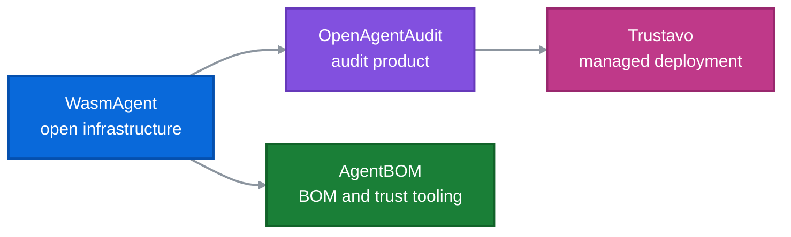
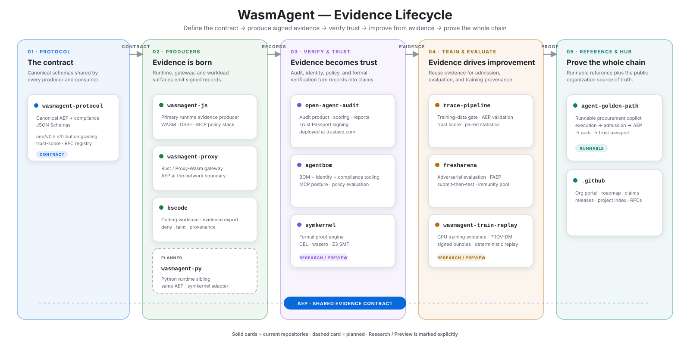

<h1 align="center">WasmAgent</h1>

<p align="center"><strong>Open infrastructure for provable AI agents.</strong></p>

<p align="center">
  Turn agent execution into signed, verifiable, auditable evidence — from runtime and gateway interception<br/>
  to formal verification, trust artifacts, training gates, and enterprise audit.
</p>

<p align="center">
  <a href="https://github.com/WasmAgent/wasmagent-protocol"></a>
  <a href="https://github.com/WasmAgent/agent-golden-path"></a>
  <a href="https://github.com/WasmAgent/.github/blob/main/claims/public-claims.yml"></a>
  <a href="https://github.com/OWASP/www-project-mcp-top-10/issues/44"></a>
</p>

<p align="center">
  <a href="#start-here">Start here</a> ·
  <a href="#evidence-lifecycle">Architecture</a> ·
  <a href="#projects">Projects</a> ·
  <a href="#standards--ecosystem">Standards &amp; ecosystem</a> ·
  <a href="#maintainers-wanted">Contribute</a>
</p>

---

> The industry's focus is shifting from *"can the agent do the task?"* to *"can the agent run reliably, at scale, over time?"* We believe that is still not enough.
>
> **The real question is: can you prove the agent ran correctly?**
>
> WasmAgent is the composable evidence layer for that question: runtime isolation, protocol-level interception, symbolic verification, tamper-evident records, trust artifacts, and regulatory evidence. Some parts ship today; some remain Research / Preview; planned work is marked explicitly.

## Four names, one system


```mermaid
flowchart LR
    W["WasmAgent<br/>open infrastructure"]:::org
    O["OpenAgentAudit<br/>audit product"]:::audit
    T["Trustavo<br/>managed deployment"]:::commercial
    B["AgentBOM<br/>BOM and trust tooling"]:::bom

    W --> O --> T
    W --> B

    classDef org fill:#0969da,stroke:#0550ae,color:#ffffff,stroke-width:2px
    classDef audit fill:#8250df,stroke:#6639ba,color:#ffffff,stroke-width:2px
    classDef commercial fill:#bf3989,stroke:#99286e,color:#ffffff,stroke-width:2px
    classDef bom fill:#1a7f37,stroke:#116329,color:#ffffff,stroke-width:2px
    linkStyle default stroke:#8c959f,stroke-width:2px

    click W href "https://github.com/WasmAgent" _blank
    click O href "https://github.com/WasmAgent/open-agent-audit" _blank
    click T href "https://trustavo.com" _blank
    click B href "https://github.com/WasmAgent/agentbom" _blank
```

<table>
  <tr>
    <th align="left">Name</th>
    <th align="left">What it is</th>
    <th align="left">Who it is for</th>
  </tr>
  <tr>
    <td><strong><a href="https://github.com/WasmAgent">WasmAgent</a></strong></td>
    <td>The GitHub organization behind the open provable-agent stack.</td>
    <td>Builders who need signed, verifiable agent evidence.</td>
  </tr>
  <tr>
    <td><strong><a href="https://github.com/WasmAgent/open-agent-audit">OpenAgentAudit</a></strong></td>
    <td>The open audit specification and audit product.</td>
    <td>Enterprise teams, auditors, and regulators.</td>
  </tr>
  <tr>
    <td><strong><a href="https://trustavo.com">Trustavo</a></strong></td>
    <td>The managed commercial deployment of OpenAgentAudit.</td>
    <td>Teams that want the open stack deployed and operated for them.</td>
  </tr>
  <tr>
    <td><strong><a href="https://github.com/WasmAgent/agentbom">AgentBOM</a></strong></td>
    <td>Independent agent BOM, identity, posture, and trust tooling.</td>
    <td>Developers who need machine-readable agent identity and dependency checks.</td>
  </tr>
</table>

## Evidence lifecycle

WasmAgent is organized by the **evidence lifecycle**: define the contract → produce evidence → verify and establish trust → use evidence to improve systems → prove the whole chain in a reference implementation.

<p align="center">
  
</p>

The connective contract is **AEP (Agent Evidence Protocol)**. Producers emit signed AEP records; verification and trust components consume them; training and evaluation systems reuse the same evidence as an admission, provenance, and measurement signal.

## Start here

The fastest way to understand the stack is the public MIT-licensed **[`agent-golden-path`](https://github.com/WasmAgent/agent-golden-path)** reference application — a runnable procurement copilot that wires the lifecycle together end to end.

```bash
git clone https://github.com/WasmAgent/agent-golden-path
cd agent-golden-path
bun install && bun test        # end-to-end chain test, no live LLM required
```

The chain is concrete:

```text
agent execution
  → tool admission (mcp-firewall)
  → compliance verification
  → signed AEP evidence
  → audit report + trust passport (open-agent-audit)
```

> There is also an org-level cross-repo integration harness in [`golden-path/`](../golden-path/) — `Protect → Record → Audit → Admit`, one step per core repository. It is the multi-repo contract acceptance line and remains a work in progress. For a runnable demo, use `agent-golden-path`.

## Why provable agents?

The industry is converging on *Agent Runtime / Agent OS* as the infrastructure layer that moves agents from stateless calls to long-running, stateful, recoverable systems. We agree with that framing — and add a second requirement.

**Reliability is necessary but not sufficient.** A system that runs stably but cannot show what happened, under what authority, against which policy, and with what evidence is not ready for high-trust production environments or cross-organizational agent systems.

A plain Agent Runtime answers **"did it run?"**. The WasmAgent stack adds the machinery needed to answer **"can another party verify what it did?"**

| Layer | What it solves | Current status |
| --- | --- | --- |
| **Provable correctness** | `symkernel` — cel-go rules, wazero hard-isolation, Z3 SMT proofs; OPA Rego / AWS Cedar imports translated to CEL with fail-closed behavior | 🚧 Research / Preview |
| **Tamper-evident evidence** | AEP — signed behavioral records emitted at runtime and gateway boundaries | ✅ Shipping in `wasmagent-js` v1.x and `wasmagent-proxy` |
| **Regulatory evidence** | Audit/reporting and mapping for frameworks including EU AI Act, OWASP agent security guidance, and NIST AI RMF | 🚧 Evolving across `open-agent-audit` and `agentbom` |

## Projects

[`docs/project-index.json`](../docs/project-index.json) is the machine-readable source of truth. This repository (`.github`) is the organization's public portal.

### 📐 01 · Protocol — the contract

Canonical JSON Schemas shared across the organization. Published as `@wasmagent/protocol` (npm) and `wasmagent-protocol` (PyPI). Schemas are **not vendored**; consumers depend on the published package boundary.

| Repository | Role |
| --- | --- |
| **[wasmagent-protocol](https://github.com/WasmAgent/wasmagent-protocol)** | **Canonical AEP + compliance JSON Schemas** — `aep-record` with aep/v0.5 attribution grading (floor, itemization, evidence count), compliance contract family, trust-score schema, and RFC registry. Released 0.1.10. |

### ⚡ 02 · Evidence producers — where signed evidence is born

| Repository | Role |
| --- | --- |
| **[wasmagent-js](https://github.com/WasmAgent/wasmagent-js)** | **Runtime monorepo** (v1.x, 40+ packages) — WASM kernels (QuickJS, Pyodide, Wasmtime, Remote), AEP emitter with aep/v0.5 attribution grading and DSSE signing, MCP gateway + attestation + firewall + posture, capability manifests, model adapters, CLI, devtools, evals-runner, Cloudflare Worker, and React components. The **primary evidence producer**. |
| **[wasmagent-proxy](https://github.com/WasmAgent/wasmagent-proxy)** | **Gateway** (Rust, Proxy-Wasm) — network-boundary evidence engine for Envoy, Istio, Kong, and Consul. Emits aep/v0.5 records with DSSE signing and attribution grading before requests reach the runtime. |
| **[bscode](https://github.com/WasmAgent/bscode)** | **Coding workload** on Cloudflare Workers — AEP evidence export, deny capabilities, output taint labels, and RolloutProvenance. |

> **`wasmagent-py` — planned.** The Python runtime sibling is intended to use the same AEP schema, Criterion / ConstraintIR protocol, and symkernel adapter so evidence is emitted wherever agents run, not only in JS.

### 🔍 03 · Verification & trust — checking evidence, establishing trust

| Repository | Role |
| --- | --- |
| **[open-agent-audit](https://github.com/WasmAgent/open-agent-audit)** | **Audit product** — adapters (AEP → canonical events), Evidence Admission Score with attribution-integrity bonus, policy audit, Markdown / HTML / PDF / CSV / JSON reports, dashboard, Worker deployment, and Trust Passport signing. Deployed at [trustavo.com](https://trustavo.com). |
| **[agentbom](https://github.com/WasmAgent/agentbom)** | **Trust & BOM tooling** — AgentBOM validator, compliance checker (SOC 2 / ISO 27001 / EU AI Act), MCP Posture diff engine, CLI, framework adapters, and WASM-native OPA / Rego policy evaluation. |
| **[symkernel](https://github.com/WasmAgent/symkernel)** | **Formal proof engine** (Go, Research / Preview) — cel-go rules, wazero Wasm sandbox hard-isolation, and Z3 SMT proofs; imports OPA Rego / AWS Cedar policies through fail-closed translation to CEL. |

### 📊 04 · Training & evaluation — evidence-driven improvement

| Repository | Role |
| --- | --- |
| **[trace-pipeline](https://github.com/WasmAgent/trace-pipeline)** | **Training-data gate** (`evomerge` on PyPI) — AEP validation, attribution-grading consumption, trust score, paired statistics, adversarial suite, and training-data admission gate. |
| **[fresharena](https://github.com/WasmAgent/fresharena)** | **Adversarial evaluation** — FAEP schema, submit-then-test, Public Immunity Pool; technical paper in preparation. |
| **[wasmagent-train-replay](https://github.com/WasmAgent/wasmagent-train-replay)** | **GPU training evidence** (Research / Preview) — PyTorch Flight Recorder ingestion, cross-rank PROV-DM provenance graph, Ed25519-signed `EpochEvidenceBundle`, tensor-origin tracing, and deterministic replay. |

### 🔗 05 · Reference & hub — prove and explain the whole chain

| Repository | Role |
| --- | --- |
| **[agent-golden-path](https://github.com/WasmAgent/agent-golden-path)** | **Golden Path** — runnable procurement copilot proving execution → `mcp-firewall` → compliance → signed AEP evidence → audit report + trust passport. `bun install && bun test`; no live LLM required. |
| **[`.github`](https://github.com/WasmAgent/.github)** | **Organization hub** — portal, roadmap, claims registry, release ledger, project index, and cross-repository documentation. |

## How the runtime pieces connect

The **gateway** layer — `wasmagent-proxy` — sits at the network boundary, intercepting Agent / MCP / A2A HTTP traffic across Envoy, Istio, Kong, and Consul and emitting signed AEP records before requests reach the runtime.

The **runtime** layer — `wasmagent-js` v1.x — protects agent execution across multiple WASM kernels, enforces MCP policy through `mcp-gateway` and `mcp-attestation`, and emits signed AEP events into verifiable runtime traces. The planned `wasmagent-py` sibling will share the same AEP contract and symkernel adapter.

`symkernel` backs the verification direction with symbolic techniques: cel-go for high-frequency rule evaluation, wazero for hard-isolated Wasm execution of generated code, and Z3 for combinatorial constraint proofs. It is Research / Preview, with no stable public API or package guarantee yet.

`bscode` and `fresharena` are the two live agent surfaces — coding workload and adversarial evaluation — both instrumented to produce AEP evidence.

`trace-pipeline` (`evomerge`) consumes evidence for training-data admission and paired statistical evaluation. `wasmagent-train-replay` extends the evidence model to distributed GPU jobs using Flight Recorder data, PROV-DM causal graphs, signed epoch bundles, and deterministic replay.

`agentbom` produces machine-readable trust artifacts. `agent-trust-infra` is archived and superseded by `agentbom`; `@wasmagent/mcp-posture` now lives in `wasmagent-js` alongside `@wasmagent/mcp-firewall`. The Trust Passport specification lives in `wasmagent-protocol`; the Trust Passport product lives in `open-agent-audit`.

`open-agent-audit` turns the evidence chain into enterprise-readable audit artifacts and is deployed at **[trustavo.com](https://trustavo.com)**. `fresharena` closes the feedback loop with dynamic, verifiable adversarial evaluation.

## Standards & ecosystem

### Public claims

**5 public claims — all `supported`** · Registry last reviewed **2026-09-12**

[`claims/public-claims.yml`](../claims/public-claims.yml) records public software-property claims together with evidence links and review dates so they can be checked independently. This is deliberately separate from marketing copy.

### Active OWASP MCP Top 10 upstream work

The following are **open upstream discussions / proposals**, not claims of OWASP endorsement or adoption:

| Upstream item | Scope | Status |
| --- | --- | --- |
| [Issue #44](https://github.com/OWASP/www-project-mcp-top-10/issues/44) | Verifiable Authorization Lineage; offline-verifiable non-repudiation and attribution evidence | Open discussion |
| [PR #58](https://github.com/OWASP/www-project-mcp-top-10/pull/58) | Recommended control: verifiable authorization lineage; graded attribution and offline scope re-evaluation | Open PR |
| [PR #50](https://github.com/OWASP/www-project-mcp-top-10/pull/50) | MCP08 agent decision evidence; tamper-evident records and AEP implementation reference | Open PR |
| [PR #53](https://github.com/OWASP/www-project-mcp-top-10/pull/53) | MCP07 identity and OAuth trust boundaries | Open PR |

The goal is to contribute implementation-neutral control language and concrete open reference implementations where useful — while keeping upstream status explicit.

## Trustavo

**[Trustavo](https://trustavo.com)** is the production deployment of OpenAgentAudit. It exists to make the evidence produced by the open stack legible to enterprise teams, auditors, and regulators: not just "a log exists," but what was verified, what evidence supports the result, and what remains outside the claim boundary.

## Governance continuity

The primary maintainer for WasmAgent is [@telleroutlook](https://github.com/telleroutlook). Report urgent issues in the relevant project repository. If there is no response within 7 days, escalate through an [issue in `WasmAgent/.github`](https://github.com/WasmAgent/.github/issues) and tag [@telleroutlook](https://github.com/telleroutlook).

Core repositories — `wasmagent-js`, `wasmagent-protocol`, and `agentbom` — are actively maintained. `symkernel` and `wasmagent-train-replay` are experimental Research / Preview projects and receive best-effort updates.

## Maintainers wanted

We welcome sustained, async contributions across the stack. Commit access follows demonstrated contribution history.

| Area | Repositories / focus |
| --- | --- |
| **Runtime** | `wasmagent-js` · AEP · MCP gateway / attestation · capability manifests |
| **Runtime · Python** | planned `wasmagent-py` · Python runtime · symkernel adapter |
| **Gateway** | `wasmagent-proxy` · Rust · Proxy-Wasm · Envoy / Istio / Kong |
| **Verification** | `symkernel` · cel-go · wazero · Z3 SMT · Research / Preview |
| **Pipelines** | `trace-pipeline` / `evomerge` · measurement trust · training admission |
| **Training evidence** | `wasmagent-train-replay` · Flight Recorder · PROV-DM · GPU causal graphs |
| **Trust tooling** | `agentbom` · MCP Posture · Trust Passport contracts |
| **Audit product** | `open-agent-audit` / Trustavo · evidence reports · Workers |
| **Evaluation** | `fresharena` · verifiable adversarial evaluation |
| **Adapters** | OpenTelemetry GenAI · Langfuse · LangSmith ingestion |
| **Regulatory profiles** | OWASP agent security guidance · NIST AI RMF · ISO/IEC 42001 · EU AI Act Annex IV |
| **DevRel & docs** | quickstarts · integration walkthroughs · sample reports |

Interested? Open an issue titled `maintainer: <area>` in the relevant repository, or start a GitHub Discussion in the project home repository.

## Ledgers & registries

These organization-level records live in `.github` so they belong to the public project rather than to any single product:

- [RFC registry](../docs/RFC/README.md) — cross-repository design decisions
- [Claims registry](../claims/public-claims.yml) — public claims mapped to evidence and review status
- [Release ledger](../releases/public-release-ledger.yml) — public releases across repositories
- [Media & posts](../media/posts.yml) — talks, posts, and appearances
- [Project index](../docs/project-index.json) — machine-readable project source of truth
- [Roadmap](../docs/roadmap.md) — living roadmap aligned with the public repository set

---

### Disclaimer

Repositories in this organization produce **technical evidence** and research tooling. They do not provide legal advice, regulatory certification, or compliance determinations.
